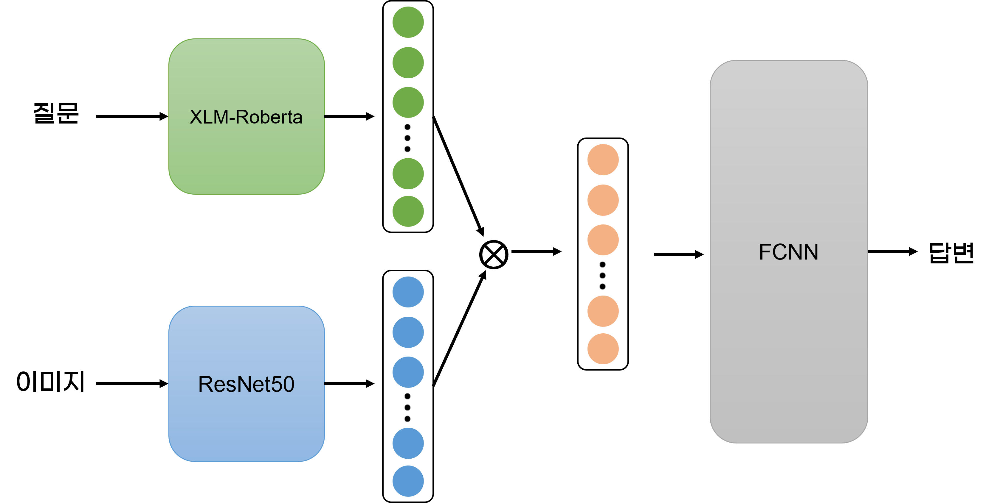
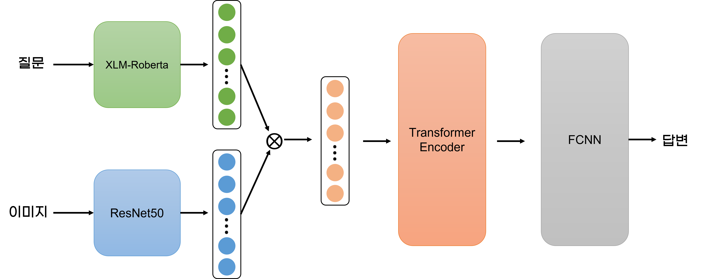

# VQA_NIA

## 0. 실험 환경

Ubuntu 20.04.4 LTS

Python 3.8.10

CUDA 11.6

GPU : NVIDIA A100 80GB x 4

CPU : AMD EPYC 7352 24-Core Processor x 48

Memory : 126G

#### 패키지 버전 설정
``` shell
pip install -r requirements.txt
```
## 1. 이미지 다운로드

- 코드를 통한 이미지 다운로드
```python
python download.py
```

- 다음의 에러가 발생한다면 g-drive에서 `image.zip`파일을 직접 다운로드 하셔야 합니다. [[Image Download Link]](https://drive.google.com/file/d/1E4JBTFGuGiGVjjcBDU9091Ahg480StjT/view?usp=sharing) (12.97GB)

```
Access denied with the following error:

        Too many users have viewed or downloaded this file recently. Please
        try accessing the file again later. If the file you are trying to
        access is particularly large or is shared with many people, it may
        take up to 24 hours to be able to view or download the file. If you
        still can't access a file after 24 hours, contact your domain
        administrator.

You may still be able to access the file from the browser:
```

## 2. 디렉토리 구조

```
VQA_NIA
┣━━━ data
┃      ┗━━━ image
┃      ┃       ┗━━━ image1
┃      ┃       ┗━━━ image2
┃      ┃       ┗━━━ ...
┃      ┗━━━ data.csv   
┗━━━ main.py
┗━━━ model.py
┗━━━ train.py
┗━━━ util.py
┗━━━ focal.py
┗━━━ vqa_dataset.py
┗━━━ download.py
┗━━━ inference.py
┗━━━ inference_each.py
┗━━━ requirements.txt
```

>  만약 G-drive에서 `image.zip` 을 다운했다면, `image` 디렉토리를 `VQA_NIA/data/` 하위 디렉토리로 두셔야 합니다. 


## 3. 학습

#### 기본 구조
```shell
python main.py --[옵션]
```

#### 옵션
- train_data : str, choice ['A', 'B', 'all'] (default : 'all')
  - A : A형 질의 데이터
  - B : B형 질의 데이터
  - all : 모든 데이터 (A형 + B형 질의)
- n_epoch : int (default : 50)
  - 에폭 수
- lr : float (default : 3e-5)
  - 학습률
- batch_size : int (default : 512)
  - 배치 크기
- max_token : int (default : 50)
  - token max length
- use_transformer_layer : store_true
  - 해당 옵션을 사용하면 멀티모달 표현 fusion 후 Transformer Encoder Layer를 추가합니다

#### 예시
```shell
python main.py --n_epoch 30 --batch_size 128 --use_transformer_layer
```

## 4. 개별 데이터 추론

#### 기본 구조
```shell
python inference_each.py --[옵션]
```

#### 옵션
- model_path : str (default : "./results/all_1228_1734/infer_model_57.15.pt")
    - 저장된 모델 경로

#### 예시
```shell
python inference_each.py --model_path ./results/all_1228_1734/infer_model_57.15.pt
```

## 5. 모든 데이터 추론 (Test 성능 확인)

#### 기본 구조
```shell
python inference.py --[옵션]
```

#### 옵션
- model_path : str (default : "./results/all_1228_1734/infer_model_57.15.pt")
    - 저장된 모델 경로

- infer_data : str, choice ['all', 'abstract', 'triple', 'vqa'] (default : 'all')
    - 추론하고자 하는 데이터 종류

#### 예시
```shell
python inference.py --model_path ./results/all_1228_1734/infer_model_57.15.pt --infer_data vqa
```

## 6. 모델 설명

> Question Feature Extractor : XLM-Roberta-base

- License : MIT License
- Model Link : https://huggingface.co/xlm-roberta-base
- Model Task : Sequence classification, Token classification or Question Answering.
- transformers version : 4.25.1

> Image Feature Extractor : ResNet50 (timm)
- License : MIT License
- Model Link : https://rwightman.github.io/pytorch-image-models/models/resnet/ 
- Model Task : Image Classification, Image Recognition
- timm version : 0.4.12

<br><br/> 

#### 기본 모델


- XLM-Roberta
  - 질문을 입력받아 Representation을 출력

- ResNet50
  - 이미지를 입력받아 Representation을 출력

## 
#### Transformer encoder layer 추가

